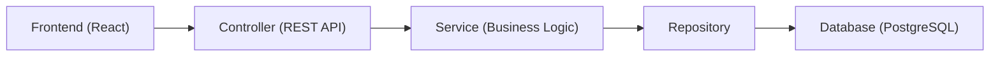

# to-do-list-springboot-react
A simple demo full-stack web application built with Spring Boot (backend) and React (frontend). It allows each registered user to create, view, and manage their own tasks, marking them as completed or incomplete.

## Technologies used:

**Backend**
- Spring Boot
- Spring Security
- Spring Data JPA
- PostgreSQL

**Frontend**
- React
- Axios

## Architecture:

**Application flow:**

**Frontend-backend communication:** uses REST API calls via Axios

## Features:
- **User authentication:** login and logout functionality (passwords hashed in the database using Spring Security)
- **Task management:** create tasks with title and description
- **Task control:** delete tasks or mark them as complete/incomplete

## Future Improvements:
- **UI enhancements:** improve the look and feel of the app
- **Improve security:** add further protections (currently, CSRF is disabled for development and CORS is set to allow only the frontend on localhost)
- **Task scheduling:** correct task timestamps to match actual local time
- **Additional features:** implement new functionalities to increase usability

## About this project:
This project was created as a personal exercise to learn and practice full-stack development in my free time. It helped me understand how frontend and backend communicate, manage authentication, work with a database, and gave me practical experience with Spring Boot and React.
